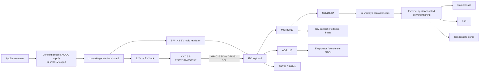

# Low-Voltage Interface Wiring — V0.1 Concept

> **UNREVIEWED / UNASSEMBLED / UNTESTED.** This is a connection-level engineering sketch for low-voltage prototyping. It is not a certified appliance schematic and it intentionally does not define a universal mains power board.

## Block diagram



## CYD to external board

| CYD signal | GPIO | External connection | Notes |
|---|---:|---|---|
| SDA | 25 | J2-3 | Dedicated appliance-control I2C for this project |
| SCL | 32 | J2-4 | 100 kHz initial bus rate |
| GND | — | J2-2 | Common low-voltage ground |
| 3.3 V logic reference | — | J2-1 | Use only as logic reference if the external board has its own 3.3 V regulator; do not assume it can power relay hardware |
| TFT backlight | 27 | **not available** | Reserved by the E32N35T display |

## I2C bus

```text
3.3 V ----+---- 4.7k ---- SDA ---- GPIO25 CYD
          |                 +------ MCP23017 SDA
          |                 +------ ADS1115 SDA
          |                 +------ SHT3x/SHT4x SDA
          |
          +---- 4.7k ---- SCL ---- GPIO32 CYD
                            +------ MCP23017 SCL
                            +------ ADS1115 SCL
                            +------ SHT3x/SHT4x SCL
```

Nominal addresses: MCP23017 `0x20`, ADS1115 `0x48`, SHT31/SHT4x typically `0x44`.

## MCP23017 output assignment

| MCP pin | Logical output | Driver |
|---|---|---|
| GPA0 | Compressor coil request | ULN2803 channel 1 |
| GPA1 | Fan low/main | ULN2803 channel 2 |
| GPA2 | Fan high/secondary | ULN2803 channel 3 |
| GPA3 | Condensate pump | ULN2803 channel 4 |
| GPA4 | Defrost / auxiliary | ULN2803 channel 5 |
| GPA5 | Low-voltage alarm | ULN2803 channel 6 |

The ULN2803 COM pin connects to +12 V coil supply for flyback protection. The board sinks relay/contactor **coil current only**.

## Dry-contact inputs

V0.1 field digital inputs are dry contacts to ground only. Each channel uses a 10 kΩ pull-up, 1 kΩ series resistor and 100 nF filter. Suggested GPB0..3 assignments are bucket-full, secondary high-water, interlock, and auxiliary.

## Thermistor / ADS1115 channel

```text
3.3 V -> 10k 0.1% reference -> sense -> NTC -> GND
                               |
                               +-> 1k -> ADS1115 Ax
                                          |
                                        100 nF
                                          |
                                         GND
```

A0 evaporator, A1 condenser, A2 auxiliary, A3 spare. Open/short thresholds and the actual thermistor curve must be validated before a temperature channel becomes a required compressor-safety input.

## Condensate pump concept

The pump output is distinct from the bucket-full shutdown input. A future `PUMP_CALL` float may request pumping while an independent `SECONDARY_HIGH` float forces compressor OFF and raises a fault. This supports bucket, gravity-drain, or pumped garden-water collection without making the pump the only overflow protection.

## Mains boundary

No mains trace, compressor lead, fan lead, or pump mains lead is defined on this V0.1 controller board. A future appliance-specific power-interface drawing must be created for each machine after its nameplate, wiring diagram, motor type, overload/start components, and relay/contactor requirements are documented.
